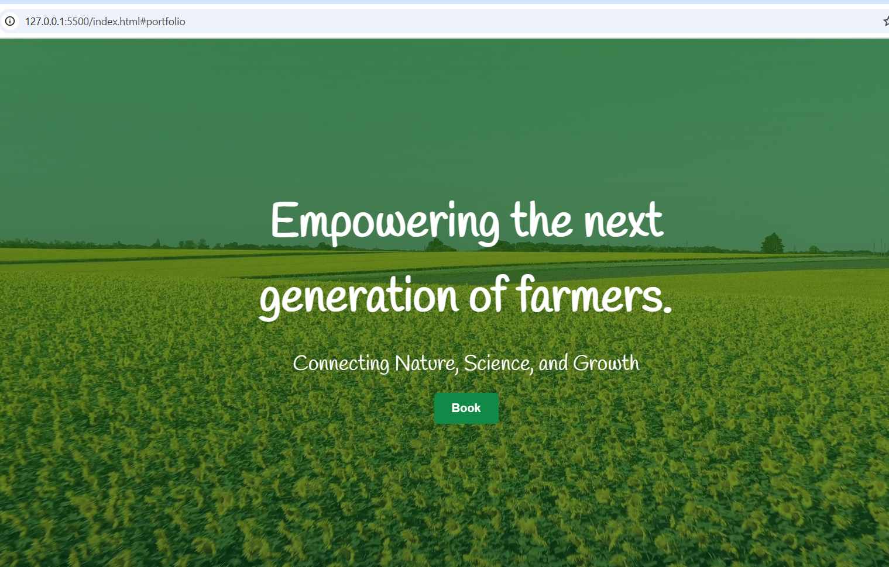

# 🌾 VerdantLink AgriTech — Smart Farming for a Sustainable Future

A fully responsive **multi-page agricultural technology website** built with **vanilla HTML, CSS, and JavaScript**.  
This project showcases **VerdantLink AgriTech**, a fictional firm that bridges traditional farming with smart, eco-friendly technology for sustainable food production.

---

## 📂 Features

* ✅ **Responsive layout** – Works on mobile, tablet, and desktop
* ✅ **Interactive navigation & animations** – Smooth transitions and toggled menus
* ✅ **Contact form validation** – Simple JavaScript-based interactivity
* ✅ **Eco-inspired design** – Nature-themed visuals and colors
* ✅ **Pure Vanilla Stack** – No frameworks, no dependencies

---

## 📁 Project Structure

```
/project
  ├── index.html          # Home page
  ├── css/
  │     └── style.css     # Main stylesheet
  ├── js/
  │     └── main.js       # Interactivity and animations
  └── images/             # Images and icons
```

---

## 🛠️ Getting Started

### 1. Clone the repo

```bash
git https://github.com/grey-hat-piper/plp-webtechnologies-classroom-july2025-july-2025-final-project-and-deployment-Final-Project-and-Depl.git
cd plp-webtechnologies-classroom-july2025-july-2025-final-project-and-deployment-Final-Project-and-Depl
```

### 2. Open in browser

Simply open `index.html` in your browser to preview the site.  
*(No build tools required – it’s pure HTML/CSS/JS.)*

---

## 🎨 Customization

* Update colors, fonts, and layout in `css/style.css` (look for variables at the top).  
* Replace placeholder images in `/images/` with real agricultural visuals.  
* Edit text directly inside the `.html` files to personalize content.  

---


## 🖼️ Website Preview

Below is a preview of the VerdantLink AgriTech website:



*For a live experience, visit the [demo link]([https://your-username.github.io/verdantlink-agritech](https://grey-hat-piper.github.io/plp-webtechnologies-classroom-july2025-july-2025-final-project-and-deployment-Final-Project-and-Depl/)).*

## 🧠 Project Purpose

This project was built as part of a **Final Assignment** for demonstrating full-stack web development skills, including:

* Proper HTML5 structure and semantics  
* Responsive CSS design  
* JavaScript interactivity  
* Clean project organization  
* Live deployment using GitHub Pages  

It represents a **production-ready concept** for a modern AgriTech company that integrates sustainability and digital innovation.

---

## 📜 License

This project is licensed under the **MIT License** — feel free to use, modify, and share.

---

### 🌱 “Connecting Nature, Science, and Growth.”
